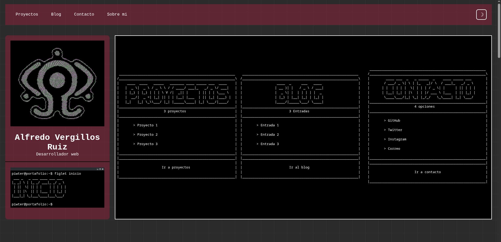
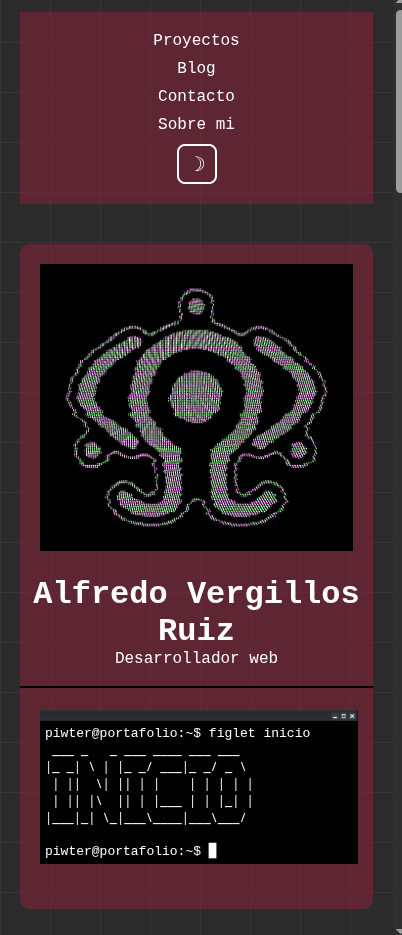
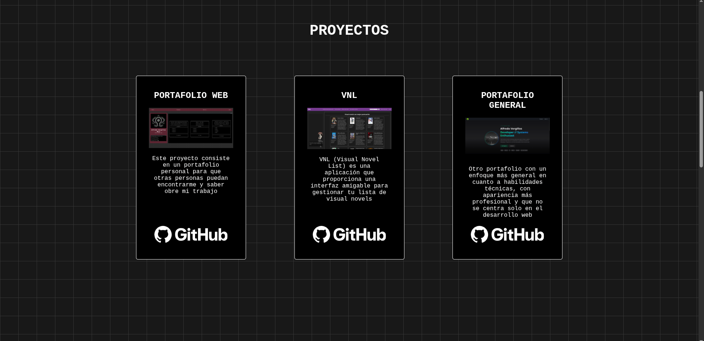
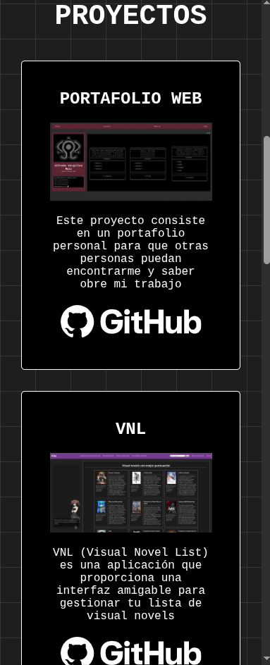
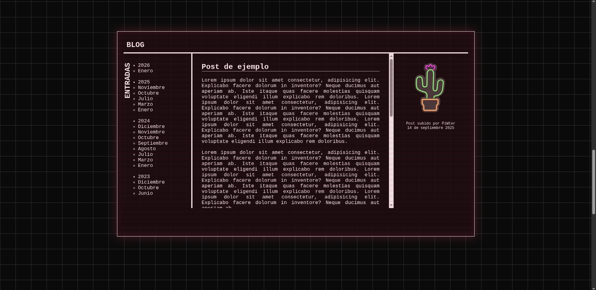
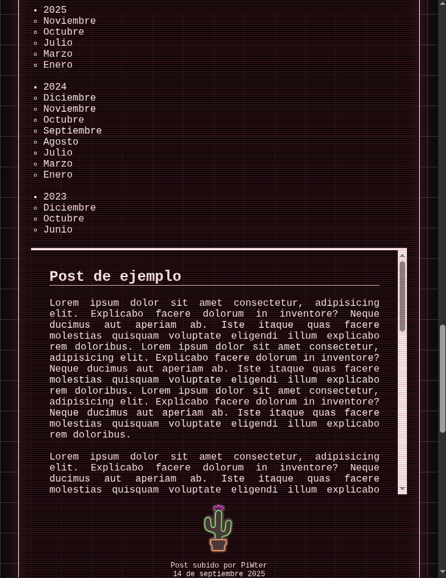
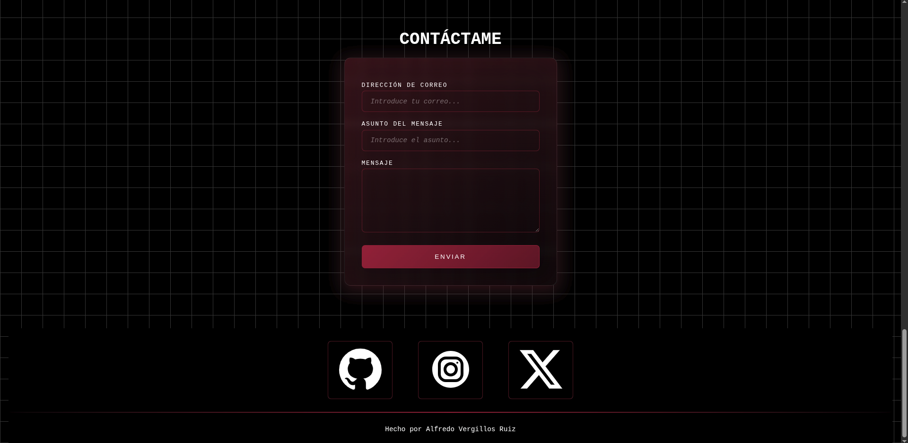
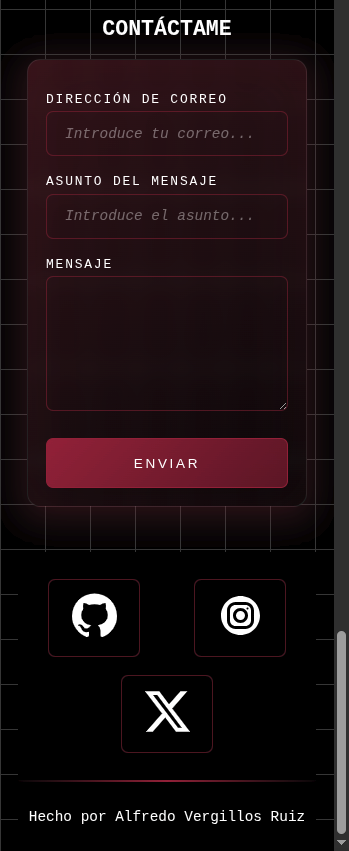

# PORTAFOLIO ALFREDO VERGILLOS RUIZ

## FINALIDAD

Este es un proyecto para el cilo de desarrollo de aplicaciones web en el que creo un portafolio personal.

La finalidad de este trabajo es tener una plantilla para mostrar mis proyectos y mis intereses a la gente en internet y a posibles reclutadores para trabajo.

## ENLACE

Es posible acceder a la página del portafolio pulsando [aquí](https://portafolio-nine-eosin-33.vercel.app/)

## ESTRUCTURA

Mi portafolio consta principalmente de cuatro partes:

- INICIO
- PROYECTOS
- BLOG
- CONTACTO

### INICIO

El apartado de inicio simplemente está para mostrar la estructura del resto de la página. Desde aquí se puede acceder al resto de apartados disponibles. Este apartado cuenta con mi nombre, el sector del desarrollo al que me dedico, una imagen de perfil, y dos maneras de acceder a los diferentes apartados de la página, una mediante la barra de navegación superior, y otra, más general, con las opciones de al lado de mi perfil

Aquí se puede ver la versión de escritorio

Aquí se puede ver la versión móvil

### PROYECTOS

El apartado de proyectos se enfoca en mostrar los proyectos en los que he trabajado. Esto me permite demostrar qué conocimientos tengo y permitirá a personas que buscan un perfil específico de desarrollador saber si encajo en las necesidades de un proyecto.

Aquí se puede ver la versión de escritorio

Aquí se puede ver la versión móvil

### BLOG

Este es un apartado más personal. Estará dedicado a documentar mis pensamientos y progresos sobre proyectos específicos o sobre temas relacionados con la tecnología.

Aquí se puede ver la versión de escritorio

Aquí se puede ver la versión móvil

### CONTACTO

Finalmente, el apartado de contacto está dedicado a permitir que las personas a las que les interese mi trabajo puedan saber más sobre mí, y por supuesto, les permitirá ponerse en contacto conmigo en caso de ser necesario

Aquí se puede ver la versión de escritorio

Aquí se puede ver la versión móvil
